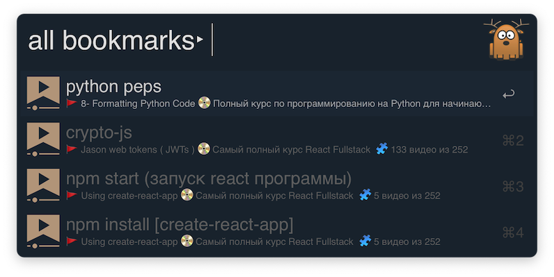

# alfred-coursehunters-bookmarks [](https://travis-ci.org/bikenik/alfred-coursehunters-bookmarks)

> coursehunters-bookmarks + dashboard [Safari]





## Install

```
$ npm install --global alfred-coursehunters-bookmarks
```

or as [ `coursehunters-bookmarks.alfredworkflow`](https://github.com/bikenik/alfred-coursehunters-bookmarks/releases)

_Requires [Node.js](https://nodejs.org) 7.6+ and the Alfred [Powerpack](https://www.alfredapp.com/powerpack/)._

## Usage

In Alfred, type `ch`, <kbd>Enter</kbd>, and your query.<br>
It will be work with Safari only.

#### Bookmarks

- To create bookmark needs to have opened Safari's window with coursehunetrs.net's video player in active tab.
- type some shortcut (⌥⌘B - for example) to create bookmark
- type some shortcut (⌥⌘S - for example) to show and go through the bookmark in the current playing video.
- <kbd>fn+↵</kbd> to delete one or several bookmarks (in specific filters will be deleted all bookmarks in current filter)
- hit <kbd>⇧</kbd> To open preview window by the any bookmark.

<a href="https://www.buymeacoffee.com/cLMme6h" target="_blank"></a>

#### Setting for Chrome

```
View => Developer => check "Allow Javascript for Apple Evenst"
```

## License

MIT © [bikenik](http://bikenik.org)
